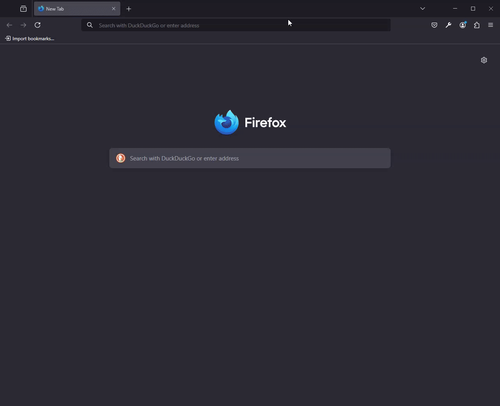

# dex-tailscale

Simple [Dex](https://dexidp.io) setup to authenticate with [Tailscale](https://tailscale.com).

This means you can login to services that support OIDC authentication using only your Tailscale IP!

**Note:** You can (and should) try Tailscale's [tsidp](https://pkg.go.dev/tailscale.com/cmd/tsidp) instead if you only need auth via Tailscale!

## Demo

Here is an example video of authenticating to [Cloudflare Access](https://www.cloudflare.com/zero-trust/products/access/) with Tailscale:

## Setup

Fill in the values in `dex.env` and `tailscale.env` using `dex.env.example` and `tailscale.env.example` respectively.

The default `dex.yaml` configuration includes Cloudflare Access as a client, but you can update this if you want :)

Then just run `docker compose up` and you're done!
